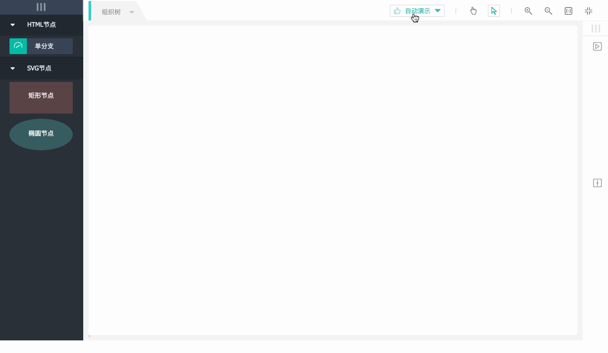

# treebuilder

The project is no longer maintained

### 说明

一款专注于构建树状模型的工具

### 特性

* 基于HTML5 Draggable实现可灵活定制的拖拽式面板
* 支持纯SVG节点与可定制丰富元素的模板节点
* 可用于绘制复杂结构的树状模型,包括特例二叉树
* 支持可视化修改节点属性,画板大小及模型布局

### 示例

